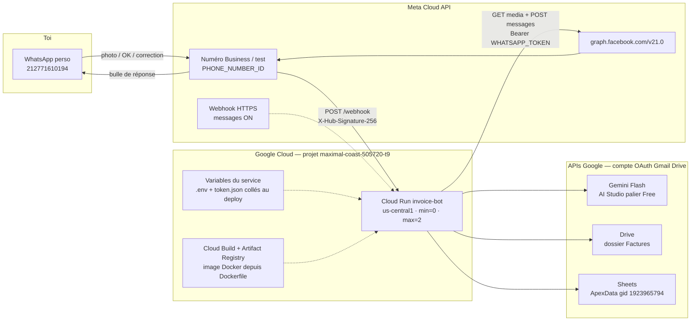
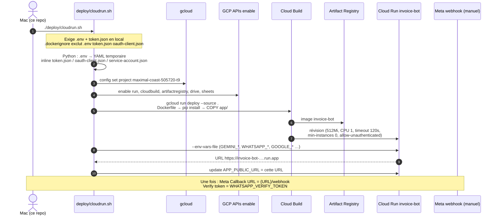
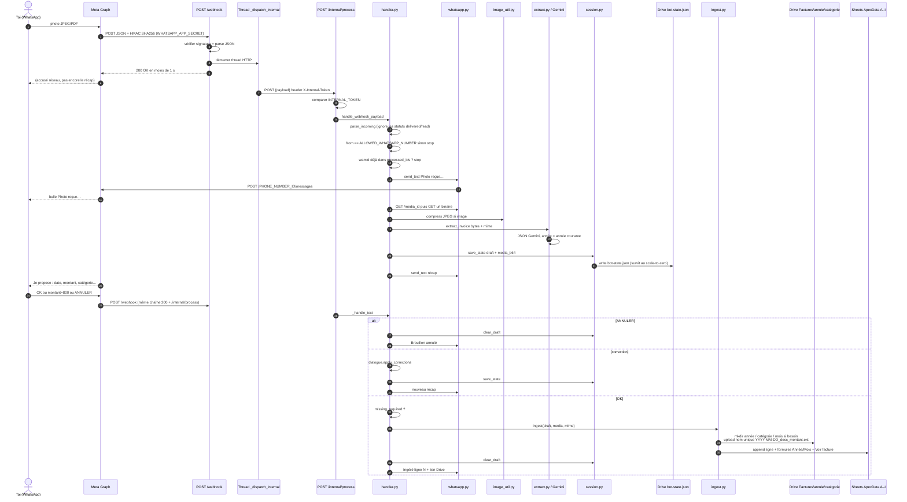
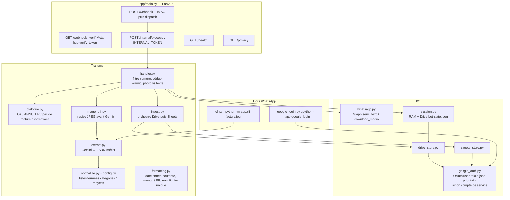
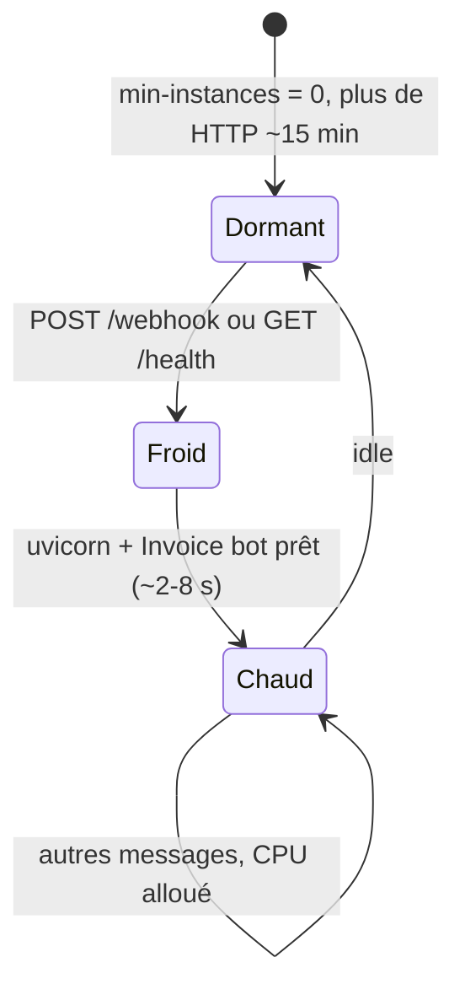

# Bot WhatsApp d’ingestion de factures

Tu envoies une **photo** sur WhatsApp. Le bot lit la facture (Gemini Flash **gratuit**), t’envoie un **récap à valider**, puis range le fichier dans **ton dossier Drive existant** (Gazoil, Repas_pro, etc.) et ajoute **une ligne** dans [ApexData](https://docs.google.com/spreadsheets/d/1kr2GXsZsv8NxdydHc97kK_ELBGc2QImBLT-5ZVmprb4/edit?gid=1923965794#gid=1923965794) (colonnes **A–I uniquement**).

Rien n’est écrit tant que tu n’as pas répondu **OK**. Coût visé : **0 €** (quotas gratuits, ~200 factures/mois).

## Comment ça marche

Le Mac **n’est pas** dans la boucle une fois déployé. WhatsApp réveille Cloud Run ; Cloud Run parle à Meta, Gemini, Drive et Sheets.

### 1. Qui appelle qui (prod)



| Pièce | Utilité | Qui l’appelle |
|---|---|---|
| **WhatsApp perso** | Seul canal humain. Photo, `OK`, `montant=…`, `ANNULER`. | Toi |
| **Meta / WABA** | Transporte les messages. N’extrait rien. Abonne `messages` vers l’URL Cloud Run. | Toi → Meta ; Meta → Cloud Run |
| **Cloud Run `invoice-bot`** | Exécute FastAPI. Dort à 0 instance, se réveille sur HTTP. | Meta `POST /webhook` |
| **Variables d’env** | Clés (pas de `.env` dans l’image). Injectées par `deploy/cloudrun.sh`. | Cloud Run au boot |
| **Gemini** | OCR + JSON date / montant / catégorie / moyen. | `app/extract.py` |
| **Drive** | Fichier facture + `bot-state.json` (brouillon si le conteneur meurt). | `app/drive_store.py` après **OK** (fichier) ; `app/session.py` en continu (état) |
| **Sheets** | Une ligne colonnes **A–I**. | `app/sheets_store.py` après **OK** |

### 2. Déploiement (`deploy/cloudrun.sh`)

Le script **ne pousse pas GitHub**. Il lit les secrets **sur le Mac** et envoie code + variables à GCP.



Fichiers déploiement :

| Fichier | Rôle |
|---|---|
| `Dockerfile` | Image Python 3.12, `uvicorn app.main:app` sur `$PORT` |
| `.dockerignore` | Empêche `.env` / jetons d’entrer dans l’image |
| `deploy/cloudrun.sh` | Build + env + `APP_PUBLIC_URL` |
| `Procfile` | Fallback PaaS (Koyeb, etc.) si pas Cloud Run |

### 3. Enchaînement d’une facture (après le deploy)

Meta exige un **HTTP 200 en ~5 s**. Gemini prend 8–20 s, donc en prod Cloud Run **ne traite pas** dans le `POST /webhook` : il relance une 2ᵉ requête sur lui-même (`/internal/process`) avec CPU alloué jusqu’à 120 s.



**Rien n’est écrit dans ApexData / le dossier catégorie tant que `OK` n’est pas reçu.** Avant ça, seul `bot-state.json` (brouillon) est mis à jour.

### 4. Modules Python — qui appelle qui



| Module | Rôle précis |
|---|---|
| `main.py` | Ports HTTP. Prod : ack rapide + auto-appel `/internal/process`. Local : `BackgroundTasks` si `APP_PUBLIC_URL` vide. |
| `handler.py` | Un message à la fois côté métier : 1 brouillon, 1 fichier. Un album de 3 photos = 3 récaps, le **dernier** gagne. |
| `whatsapp.py` | Client Graph v21. Sans token valide : le webhook peut arriver, **aucune bulle** en retour. |
| `extract.py` | Essaie plusieurs modèles Flash si 404. |
| `session.py` | État partagé. Cloud Run scale-to-zero → relecture Drive. |
| `google_auth.py` | Refresh OAuth en mémoire (pas d’écriture disque en prod). |
| `drive_store.py` | `Factures/{année}/{catégorie}/{MM-YYYY}/` + collision `_2`, `_3`. |
| `sheets_store.py` | Étend le tableau (bandes, listes déroulantes). Colonne I = toujours `RAS`. |
| `cli.py` | Test Gemini sans Meta. `--ecrire` pour Drive/Sheets en local. |

### 5. Réveil Cloud Run



Un **Test** Meta ou une **vraie photo** réveillent **pareil**. Pas besoin du Test pour le quotidien.

## Ce que tu dois faire une fois (comptes)

Le code est dans ce repo. Les clés et partages, c’est toi.

### 1. Gemini gratuit (sans carte)

1. Ouvre [Google AI Studio](https://aistudio.google.com/apikey).
2. Crée une clé API.
3. **N’active pas** le billing payant Gemini / AI Studio.
4. Copie la clé dans `.env` → `GEMINI_API_KEY`.

### 2. Connexion Google (Drive + Sheets)

Un compte de service **ne peut plus déposer de fichiers** dans un Drive perso (quota 0). Il faut une connexion **OAuth avec le Gmail qui possède** le dossier Factures.

1. [Google Cloud Console](https://console.cloud.google.com/) → le projet existant (`maximal-coast-505720-t9`).
2. Active **Google Drive API** et **Google Sheets API** si ce n’est pas déjà fait.
3. **APIs et services** → **Écran de consentement OAuth** → type **Externe** → ajoute **ton Gmail** en utilisateur de test.
4. **Identifiants** → **Créer des identifiants** → **ID client OAuth** → type **Application de bureau**.
5. Télécharge le JSON, place-le à la racine du repo sous `oauth-client.json` (déjà dans `.gitignore`).
6. Dans le repo :

```bash
python -m app.google_login
```

Connecte-toi avec le **même Gmail** que le Drive Factures / la feuille ApexData. Ça crée `token.json`.

`DRIVE_FOLDER_ID` est déjà l’ID du dossier **Factures** (`…/folders/1eol1-6-Z6yDaW21NVj02JOsh5DwWMN3m`). Les fichiers vont dans `Factures/2026/Gazoil/` (année + catégorie).

### 3. WhatsApp Cloud API (numéro de test, gratuit)

1. [Meta for Developers](https://developers.facebook.com/) → Créer une appli → ajoute le produit **WhatsApp**.
2. Dans WhatsApp → **API Setup** :
   - `WHATSAPP_PHONE_NUMBER_ID` (identifiant du numéro de test)
   - `WHATSAPP_TOKEN` (token temporaire au début ; pour du 24/7, crée un token système permanent)
3. **To** : ajoute **ton numéro perso** dans la liste des numéros autorisés (le numéro de test ne parle qu’à cette liste).
4. Choisis un `WHATSAPP_VERIFY_TOKEN` long et aléatoire (tu le recolles dans Meta au moment du webhook).
5. Copie aussi le **App Secret** Meta → `WHATSAPP_APP_SECRET` (signature des POST).
6. `ALLOWED_WHATSAPP_NUMBER` : ton numéro en chiffres avec indicatif, ex. `2126XXXXXXXX` (sans `+`).

Le bot **répond seulement après que tu lui aies écrit**. Pas de templates marketing (payants). On n’en crée aucun.

### 4. Fichier `.env`

```bash
cp .env.example .env
```

Remplis les valeurs. Ne commite jamais `.env` ni `service-account.json`.

## Lancer en local (pour tester l’IA)

```bash
python3 -m venv .venv
source .venv/bin/activate
pip install -r requirements.txt

# Lecture d’une vraie facture (sans WhatsApp)
python -m app.cli /chemin/vers/facture.jpg
```

Puis le serveur + un tunnel HTTPS (Meta refuse le localhost) :

```bash
uvicorn app.main:app --reload --port 8080
```

Dans un autre terminal, [Cloudflare Tunnel](https://developers.cloudflare.com/cloudflare-one/connections/connect-apps/) (gratuit) :

```bash
cloudflared tunnel --url http://localhost:8080
```

Webhook Meta : `https://<url-tunnel>/webhook`  
Verify token : la même valeur que `WHATSAPP_VERIFY_TOKEN`.  
Méthode : GET pour la vérif, POST pour les messages.

En local, laisse `APP_PUBLIC_URL` **vide** (traitement en tâche de fond). En Cloud Run, mets l’URL publique du service.

Envoie une photo au numéro WhatsApp de test. Tu dois recevoir :

1. `Photo reçue, je lis la facture…` (1–3 s)
2. Le récap à valider (environ 8–20 s)
3. Après **OK** : ligne + lien Drive

Corrections : `montant=800` / `categorie=Repas Pro` / `moyen=CB Perso` / `ANNULER`  
Sans fichier : `pas de facture` puis complète les champs et **OK**.

## Déploiement 24h/24 à 0 € — Cloud Run (recommandé)

Cloud Run **dort** après inactivité (max ~15 min) puis se **réveille** tout seul. L’URL reste joignable la nuit. Ce n’est pas une VM allumée H24.

Conditions pour rester à **0 €** :

- Région **`us-central1`** (ou `us-east1` / `us-west1`)
- **min instances = 0** (jamais 1)
- Billing **à la requête** (pas d’instance allumée en continu)
- Alerte **budget 0 USD**
- Après l’essai 90 jours : passer en compte de facturation « payant » **sans dépasser le Free Tier** (sinon Google coupe le projet). La facture reste 0 € tant que tu restes dans le quota.

```bash
# Un compte de facturation Google est demandé (carte de vérif).
export PROJECT_ID=maximal-coast-505720-t9
chmod +x deploy/cloudrun.sh
./deploy/cloudrun.sh
```

Le script colle tout le `.env` (et les JSON Google) en variables Cloud Run, puis écrit **`APP_PUBLIC_URL`**.  
Webhook Meta (prod) : `https://invoice-bot-….run.app/webhook` (l’URL exacte s’affiche en fin de script).

Le service doit être **invocable sans auth** sur `/webhook` (WhatsApp n’envoie pas de compte Google). `/internal/process` est protégé par `INTERNAL_TOKEN`.

### Garde-fous anti-facture

- Pas de billing Gemini payant
- Pas de template WhatsApp
- Pas de `min-instances=1`
- Photos compressées (~1 Mo) avant Gemini (quota 1 Gio egress / mois)

### Si tu ne veux pas Cloud Run

| Option | Carte | 24/7 | Commentaire |
|---|---|---|---|
| **Koyeb Free** | souvent non | se réveille au webhook (sommeil 1h) | même `Dockerfile`, git deploy |
| **Oracle Always Free** | vérif fréquente | VM allumée | plus de sysadmin |
| **Maison** (Pi / NAS / Mac) | non | si la machine reste allumée | + Cloudflare Tunnel |

Render / Railway gratuits / Fly.io : à éviter pour du 24/7.

## Colonnes écrites (A–I seulement)

| Colonne | Champ |
|---|---|
| A | Date `JJ/MM/AAAA` |
| B | Année |
| C | Mois `mai 2026` |
| D | Description |
| E | Catégorie (liste fermée ApexData) |
| F | Moyen de paiement |
| G | Montant DH (virgule FR) |
| H | `Voir facture` (lien Drive) ou `Pas de facture` |
| I | Remboursement : toujours `RAS` |

Le bloc budget à droite de la feuille n’est **pas** modifié.

Drive (dossiers existants, noms exacts) :

- `Voyage affaire` ← catégorie feuille **Voyage Perso**
- `Assurance_Portable` ← **Assurance Iphone**
- `Gazoil` ← **Gazoil**
- `Outils_informatique` ← **Outils informatique**
- `Voiture` ← **Entretien Voiture**
- `Consomable_bureau` ← **Consomable Bureau**
- `Internet` ← **Internet**
- `Repas_pro` ← **Repas Pro**

Lien dans la feuille, même format que tes fichiers actuels :

`https://drive.google.com/file/d/{ID}/view?usp=drive_link`

`DRIVE_FOLDER_ID` = le dossier **Factures** (celui qui contient `2026/`, `2025/`, etc.). Les 8 dossiers ci-dessus sont dedans, par année.

Le fichier `bot-state.json` dans ce dossier parent est l’état du brouillon (pour survivre au sommeil Cloud Run). Ne pas le supprimer à la main pendant une validation.

## Délais

- Premier message : 1–3 s
- Récap : 8–20 s (Gemini). +2–8 s si Cloud Run dormait
- Après OK : 2–5 s (Drive + Sheets)

## Sécurité

- Un seul numéro WhatsApp autorisé
- Factures dans **ton** Drive (le compte de service est éditeur du dossier)
- Gemini Free : les prompts peuvent servir à améliorer les produits Google — n’envoie pas de RIB / mot de passe
- Le numéro de test Meta ne parle qu’aux numéros whitelistés
